<!-- Generated by GitHub Profile Agent Console. Edit profile.config.json, then run npm run generate. -->

  <picture>
    <source media="(max-width: 760px) and (prefers-color-scheme: dark)" srcset="./assets/hero/agent-console-b07f1987-mobile-dark.svg">
    <source media="(max-width: 760px)" srcset="./assets/hero/agent-console-b07f1987-mobile-light.svg">
    <source media="(prefers-color-scheme: dark)" srcset="./assets/hero/agent-console-b07f1987-dark.svg">
    <source media="(prefers-color-scheme: light)" srcset="./assets/hero/agent-console-b07f1987-light.svg">
    
  </picture>

  

## About Me

I am an Information Technology student interested in building practical software and exploring how AI and machine learning can be integrated into useful applications.

I enjoy learning through hands-on projects, experimenting with different technologies, and turning ideas into working systems.

## Current Focus

| Area | What I am exploring |
| --- | --- |
| **Software Development** | Building practical web and mobile applications with a focus on clean architecture, usability, and maintainable systems. |
| **Artificial Intelligence** | Exploring machine learning and AI through practical experiments and application-focused projects. |
| **System Development** | Designing integrated applications that connect interfaces, APIs, databases, and supporting services. |

## Featured Work

| Project | Focus | Why it matters |
| --- | --- | --- |
| [**DataSensor**](https://github.com/deadi-id04/DataSensor) | Software project | One of my hands-on software development projects. |
| [**DataSiswa2**](https://github.com/deadi-id04/DataSiswa2) | Software project | One of my hands-on software development projects. |
| [**List_S3derhana**](https://github.com/deadi-id04/List_S3derhana) | Software project | One of my hands-on software development projects. |
| [**bc234**](https://github.com/deadi-id04/bc234) | Software project | One of my hands-on software development projects. |

## Research Direction

I am focused on building practical software applications and exploring how artificial intelligence and machine learning can be effectively integrated into modern, reliable software systems.

## Tech Stack

`Python` · `Kotlin` · `Java` · `PHP` · `JavaScript` · `TypeScript` · `HTML` · `CSS` · `FastAPI` · `Laravel` · `Android` · `Jetpack Compose` · `MySQL` · `Git` · `GitHub` · `Docker` · `Podman` · `scikit-learn`

## Recent Activity

<!-- AUTO:ACTIVITY:START -->
- Sep 20, 2026: created a branch in [deadi-id04/project_uji_coba](https://github.com/deadi-id04/project_uji_coba).
- Sep 1, 2026: created a branch in [deadi-id04/deadi-id04](https://github.com/deadi-id04/deadi-id04).
<!-- AUTO:ACTIVITY:END -->

---

  Building practical software, exploring AI, and turning ideas into working systems.

